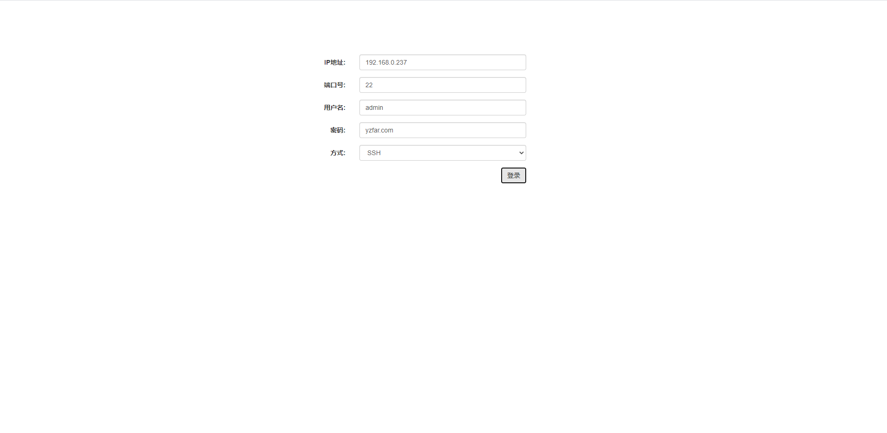
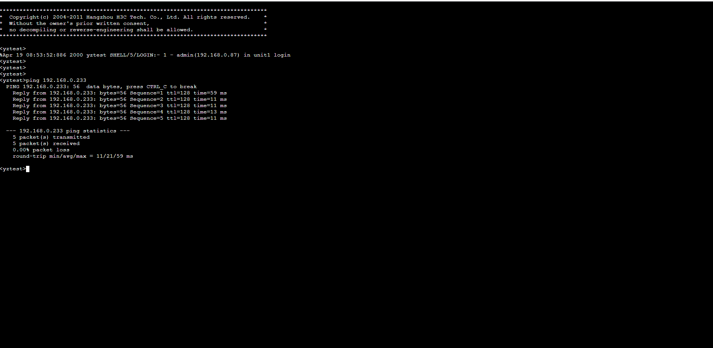

由于长期从事运维开发的工作，我本人也是一位运维厂商的开发人员，
之前写了基于浏览器H5的ssh和telnet登录工具，
受启发于(https://github.com/billchurch/webssh2)，
于是开发了java版本的，并且补充了telnet（尽管telnet不安全）
用起来还是比cs架构的方便，稍微加工之后可以用来做审计或者运维网管方面的工具，
目前国内的运维厂商还没有集成出这种工具，或者做出来的东西远远没有达到理想的要求，
本着互联网开放共享的原则，开放源代码出来，希望能够帮助到相关的人员，
也希望大家不要做拿来主义，分享自己的东西，项目采用java开发，
使用其他语言开发的话我想看过源码之后也很容易移植

主要基于webSocket实现，低版本的IE浏览器未得到支持，或者有朋友可以尝试一下其他方式

